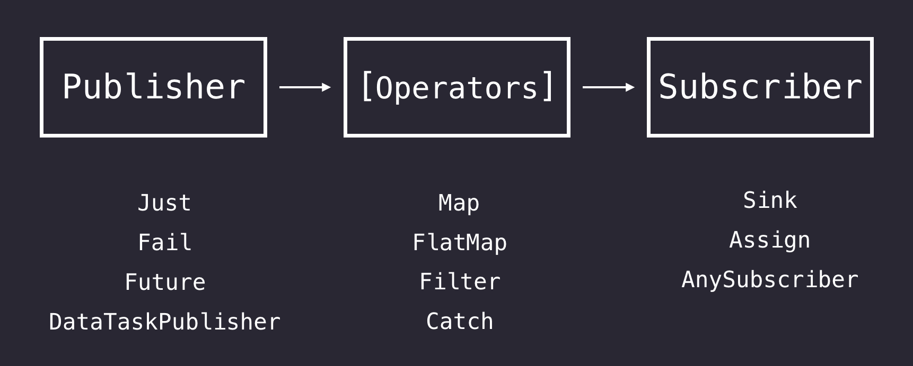
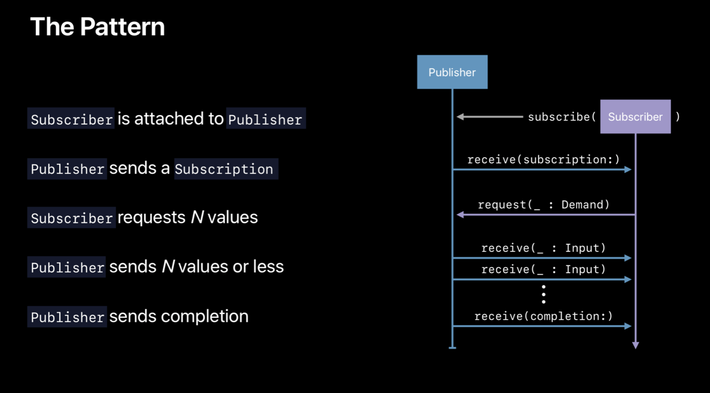

# SwiftIndia Combine Workshop –– 08 Feb 2020

## Agenda
### Session 1: Quick intro to Combine, part 1
- What is Combine
- Building blocks of Combine
- What is a Publisher
- Different types of Publishers supported by Combine
- What is a Subscriber
- Different types of Subscribers supported by Combine
- Lifecycle of publishers & subscribers 
- How to cancel a subscription

### Session 2: Quick intro to Combine, part 2

- What is an Operator
- Different types of Operators supported by Combine

### Session 3: How to make custom publishers & subscribers?
- Publisher is a protocol
- Wrapping UserDefaults into a publisher
- Subscriber is a protocol
- Wrapping UserDefaults into a subscriber

### Session 4: Combine meets UIKit
- Add TapPublisher in UIButton (UIControl in general)
- Integrate UITableViewDiffableDataSource with Combine
- Convert UIScrollViewDelegate into a Combine like API

### Session 5: Error handling in Combine
- What is Error in Combine
- How to model custom Error
- How does Error flow
- How to react to errors
- What is Fail publisher and how to use it
- What are the operators used to transform and handle errors (Catch, TryCatch, MapError, ReplaceError, SetFailureType)

### Session 6: Networking using Combine
- Networking without Combine
- Networkin with Combine
- What is DataTaskPublisher
- How to make an API request 
- How to handle response from server
- How to parse success response
- How to validate response to handle error
- How to parse and handle error

### Session 7: Handling multiple async tasks using Combine
- Handling multiple async tasks without Combine (GCD & OperationQueue)
- Combine operators that enable handling multiple async tasks
- Merge
- Zip
- CombineLatest
- Debounce

### Session 8: Handling threads using Combine
- Threading without Combine
- Threading with Combine
- SubscribeOn operator
- ReceiveOn operator

## Session 1: Quick intro to Combine, part 1
- **What is Combine**
	- The Combine framework provides a declarative Swift API for processing values over time. These values can represent many kinds of asynchronous events. 
	- Combine declares publishers to expose values that can change over time, and subscribers to receive those values from the publishers.
	- Customize handling of asynchronous events by combining event-processing operators.
	
	
- **Building blocks of Combine**
	- Publisher
	- Subscriber
	- Operator
	

- **What is a Publisher**
	- Declares that a type can transmit a sequence of values over time.
	- Source of values

- **Different types of Publishers supported by Combine**
	- Just
	- Fail
	- Future
	- Deferred
	- DataTaskPublisher
	- NotificationCenter.Publisher
	- NSObject.KeyValueObservingPublisher
	- @Published
	- PassthroughSubject
	- CurrentValueSubject
	- AnyPublisher
	- many more...
	
	
- **What is a Subscriber**
	- A Subscriber instance receives a stream of elements from a Publisher, *along with life cycle events describing changes to their relationship.*
	- Consumer of values

- **Different types of framework supported Subscribers**
	- Sink
	- Assign
	- AnySubscriber

- **Lifecycle of publishers & subscribers**

- **How to cancel a subscription**
	- Cancellable
	- AnyCancellable

## Session 2: Quick intro to Combine, part 2

- **What is an Operator**
	- Operators are those publishers which can't generate value on their own but rather transform the value provided by a source publisher or a previous operator
	- They are used between a publisher and a subscriber
	- Roughly 3 kinds of operators
		- ones which modify the values
		- ones which modify the thread
		- ones which modify the stream itself

- **Different types of Operators supported by Combine**
	- Map
	- FlatMap
	- Filter
	- Catch
	- MapError
	- Merge
	- Zip
